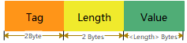

# QpyTLV - Quecpython's data serialization format

## Overview

`TLV` stands for `Tag`, `Length` and `Value`, which is a data serialization format. It features a simple structure, fast parsing speed, supports nested messages, and sequential concatenation. It is commonly used in serial communication, Bluetooth, and even network data transmission.

`QpyTLV` is a TLV structure encoder and decoder written in the Quecpython language, which also supports EMV tags.

## Data structure

### **Basic data structure**

The basic data structure is as follows:



In the diagram, the storage length of `Tag` is 2 bytes, the storage length of `Length` is 2 bytes, and the storage length of `Value` is the size specified by the `Length` value, in bytes.

### **Nested data structure**

The nested data structure is as follows:


In the diagram, the nested second-level TLV structure is the value part of its higher-level structure.

### **Concatenated data structure**

The concatenated data structure is as follows:


In the diagram, there are two sets of TLV data structures arranged in parallel.

> Any complete TLV structure can serve as the value part of another TLV.

## How to use

### **Step1. Put script files to Quectel's module**

Import the three script files involved in QpyTLV, namely `qpytlv.py`, `TLV.py`, and `OrderedDict.py`, into the file system of the Quectel module using the QPYcom tool.

> - `qpytlv.py`: User API file that implements the construction and parsing of nested TLV structures.
> - `TLV.py`: Parsing of the basic TLV structure. Users can use this to implement parsing for complex TLV structures.
> - `OrderedDict.py`: Implementation of ordered dictionaries, supplementing Quecpython's lack of support for OrderedDict. Used in TLV parsing with ordered dictionaries.

### **Step2. Import module from usr**

```python
from usr.qpytlv import QpyTLV
```

### **Step3. Define your tags list or dict if necessary**

- Define as a list

```python
tags = ['aaaa', 'bbbb', 'cccc', 'dddd', 'eeee', 'ffff', 'a5a5', 'e1e1']
```

- Define as a dictionary

```python
tags = {
    'aaaa': 'description for tag "aaaa"',
    'bbbb': 'description for tag "bbbb"',
    'cccc': 'description for tag "cccc"',
    'dddd': 'description for tag "dddd"',
    'eeee': 'description for tag "eeee"',
    'ffff': 'description for tag "ffff"',
    'a5a5': 'description for tag "a5a5"',
    'e1e1': 'description for tag "e1e1"'
}
```

> - QpyTLV requires users to specify business-related tags when creating objects. During parsing, these tags are used to match the tag field in the data structure. If there is a mismatch, the structure is considered invalid.
> - Tags can be defined using either of the two methods above. When defining tags in dictionary format, the key is the tag itself, and the value is a description of the tag.
> - Tags are limited to even-length hexadecimal strings with no fixed length. For example, `'06'` and `'abcd'` are valid tags, while `'6'` and `'abcx'` are not.
> - The reason tag length is not restricted here is that the length of the tag is stored at the lower level. If variable-length tags create inconvenience in business parsing, the tag size can be kept consistent with convenient parsing when defining tags.
> - Tags are constrained as strings during definition for user convenience. During the actual construction of TLV structures, they are converted to bytes, for example, `'abc'` would be converted to `b'\x0a\xbc'`. Note that this conversion is done according to the order in which the characters are written, i.e., "big-endian mode".

### **Step4. Create a object of class QpyTLV**

```python
tlv = QpyTLV(tags)
```

> If no parameters are passed when creating the object, the default EMV tags are used, see [`TLV.py`](./TLV.py) for details.

### **Step5. Pack user data as a specific format dict**

The basic format of user data is:
```python
{
    'hex_tag': b'value'
}
```

This structure can be nested to build nested TLV structures, as shown below:
```python
{
    'hex_tag1': {
        'hex_tag2': b'value2'
    }
}
```

It can also be extended in parallel to build concatenated TLV structures, as shown below:
```python
{
    'hex_tag1': b'value1',
    'hex_tag2': b'value2'
}
```

Based on the above rules, define user data as follows:
```python
d = {
    "aaaa": b'\xaa\xaa',
    "bbbb": {
        "cccc": b'\xcc\xcc',
        "dddd": b'\xdd\xdd'
    },
    "eeee": {
        "ffff": b'\xff\xff',
        "a5a5": {
            "e1e1": b'\xe1\xe1'
        }
    }
}
```

> User data must be in the bytes format.

### **Step6. Build a TLV structure**

```python
b = tlv.build(d)
print(b)
```

The above code constructs the TLV structure of the user data `d` into a bytes-type data `b`, which appears as follows:
```python
b'\xaa\xaa\x00\x02\xaa\xaa\xbb\xbb\x00\x0c\xdd\xdd\x00\x02\xdd\xdd\xcc\xcc\x00\x02\xcc\xcc\xee\xee\x00\x10\xa5\xa5\x00\x06\xe1\xe1\x00\x02\xe1\xe1\xff\xff\x00\x02\xff\xff'
```

> Upon careful observation, it can be noticed that the order of some parallel parts in the constructed TLV structure may differ slightly from the order defined in the original user data `d`. This is because the dictionary-type data `d` written by the user is not strictly stored in the order of writing, but rather arranged in ascending order of hash values within Quecpython. Printing `d` would reveal the actual output as follows:
> ```python
> {'aaaa': b'\xaa\xaa', 'bbbb': {'dddd': b'\xdd\xdd', 'cccc': b'\xcc\xcc'}, 'eeee': {'a5a5': {'e1e1': b'\xe1\xe1'}, 'ffff': b'\xff\xff'}}
> ```
> This order is consistent with the constructed data `b`.
> 
> **The recipient of the data should not equate the order of the parsed parallel TLV structures with their chronological order. For strict ordering requirements, multiple TLV structures can be constructed.**
> 
> One more thing to note is that the `build` interface directly modifies the data passed as a parameter during the process of building the TLV. After the interface returns, the original parameter is no longer the same. This is done to save memory. If you don't want the parameter to be modified, you can create a new dictionary based on the original value and pass it to the `build` interface, like `tlv.build(dict(d))`.

### **Step7. Parse a TLV structure**

```python
d = tlv.parse(b)
print(d)
```

Assuming the previously constructed data `b` is the TLV structure received by the user, using the code above to parse it would result in:

```python
[('aaaa', b'\xaa\xaa'), ('bbbb', b'\xdd\xdd\x00\x02\xdd\xdd\xcc\xcc\x00\x02\xcc\xcc'), ('eeee', b'\xa5\xa5\x00\x06\xe1\xe1\x00\x02\xe1\xe1\xff\xff\x00\x02\xff\xff')]
```

Users might be surprised to see that the parsed result seems quite different from the original data `d`. There are two reasons for this:

- The output uses the OrderedDict format instead of dict, to maintain consistency with the order of the TLV structure.
- Only the first level of TLV is parsed, so only parallel structures can be parsed. QpyTLV cannot determine whether the data carried by the first level is a nested substructure or the actual user data. Upon receiving the parsed data, the business logic should call the `parse` interface multiple times for nested structure parsing.

> The parsed result still has the tag part converted into corresponding hexadecimal strings, while the value part remains in bytes format.
