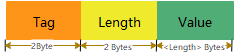
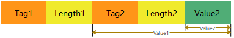
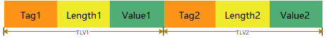

# QpyTLV - Quecpython's data serialization format

## Overview

`TLV`是`Tag（标签）`、`Length（长度）`和`Value（数值）`的简称，是一种数据序列化的格式。其结构简单、解析速度快，支持报文嵌套和顺序拼接。在串口、蓝牙甚至网络数据传输中比较常用。

`QpyTLV`是用Quecpython语言编写的TLV结构编解码器，支持emv tags。

## Data structure

### **Base data structure**

基础的数据结构如下：



图中，`Tag`的存储长度为2字节，`Length`的存储长度为2字节，`Value`的存储长度为`Length`数值所指定的大小，单位为字节。

### **Nested data structure**

嵌套的数据结构如下：



图中嵌套的第二级TLV结构是其上一级结构的数值部分。

### **Concatenated data structure**

拼接式数据结构如下：



图中是两组前后并列关系的TLV数据结构。

> 任何一个完整结构的TLV都可以作为另一个TLV的数值部分。

## How to use

### **Step1. Put script files to Quectel's module**

将QpyTLV编辑码涉及的三个脚本文件`qpytlv.py`、`TLV.py`和`OrderedDict.py`通过Qpycom工具导入到移远模块的文件系统中。

> - `qpytlv.py`：用户API文件，实现了TLV结构的嵌套构建和解析。
> - `TLV.py`：TLV基础结构的解析，用户可以基于此实现自己对复杂TLV结构的解析。
> - `OrderedDict.py`：有序字典的实现，对Quecpython不支持OrderedDict的补充，TLV解析中用到有序字典。

### **Step2. Import module from usr**

```python
from usr.qpytlv import QpyTLV
```

### **Step3. Define your tags list or dict if necessary**

- 以list的形式定义

```python
tags = ['aaaa', 'bbbb', 'cccc', 'dddd', 'eeee', 'ffff', 'a5a5', 'e1e1']
```

- 以dict的形式定义

```python
tags = {
    'aaaa': 'description for tag "aaaa"',
    'bbbb': 'description for tag "bbbb"',
    'cccc': 'description for tag "cccc"',
    'dddd': 'description for tag "dddd"',
    'eeee': 'description for tag "eeee"',
    'ffff': 'description for tag "ffff"',
    'a5a5': 'description for tag "a5a5"',
    'e1e1': 'description for tag "e1e1"'
}
```

> - QpyTLV需要用户在创建对象时，指定业务上的tags，在解析时，用于和数据结构中的tag字段进行匹配，匹配失败后，则认为是无效数据结构。
> - tag可使用以上两种方式进行定义，以dict的格式定义时，key值是tag本身，value值是对tag的描述。
> - tag限制为十六进制字符串，长度不做限制。比如`'6'`、`'abc'`、 `'a1ef'`等都是合法tag，`'g'`、`'abx'`等包含了非十六进制的字符，是非法tag。
> - 这里tag长度不做限制，是因为底层存储了tag的长度。如果不定长的tag给业务解析带来了不便，则业务上定义tag时，将长度保持为方便解析的大小即可。
> - 为了方便用户书写，这里才将tag在定义时约束为字符串，实际构建TLV结构时，是将其转换为bytes类型的，比如`'abc'`会转换为b'\x0a\xbc'。注意这里是按照字符串的书写顺序转换的，即`大端模式`。

### **Step4. Create a object of class QpyTLV**

```python
tlv = QpyTLV(tags)
```

> 如果创建对象时，不传入参数，则使用默认的emv_tgas，详见`TLV.py`。

### **Step5. Pack user data as a specific format dict**

用户数据的基础格式为：
```python
{
    'hex_tag': b'value'
}
```

以上结构可以做嵌套，用于构建嵌套的TLV结构，如下所示：
```python
{
    'hex_tag1': {
        'hex_tag2': b'value2'
    }
}
```

也可以做并列扩展，用于构建拼接的TLV结构，如下所示：
```python
{
    'hex_tag1': b'value1',
    'hex_tag2': b'value2'
}
```

基于以上规则，定义如下用户数据：
```python
d = {
    "aaaa": b'\xaa\xaa',
    "bbbb": {
        "cccc": b'\xcc\xcc',
        "dddd": b'\xdd\xdd'
    },
    "eeee": {
        "ffff": b'\xff\xff',
        "a5a5": {
            "e1e1": b'\xe1\xe1'
        }
    }
}
```

> **用户数据全部限制为bytes格式**。

### **Step6. Build a TLV structure**

```python
b = tlv.build(d)
print(b)
```

以上代码将用户数据d构建为TLV结构的bytes类型数据b，数值如下：
```python
b'\xaa\xaa\x00\x02\xaa\xaa\xbb\xbb\x00\x0c\xdd\xdd\x00\x02\xdd\xdd\xcc\xcc\x00\x02\xcc\xcc\xee\xee\x00\x10\xa5\xa5\x00\x06\xe1\xe1\x00\x02\xe1\xe1\xff\xff\x00\x02\xff\xff'
```

> 细心观察会发现，构建出的TLV结构，并列的部分，有些顺序和用户数据d中定义的顺序不太一样，因为用户书写的dict类型的数据d，在Quecpython中的存储不是严格按照用户书写顺序而来，而是按照哈希值的大小顺序排列的，使用`print(d)`打印，会发现实际输出的结果为：
> ```python
> {'aaaa': b'\xaa\xaa', 'bbbb': {'dddd': b'\xdd\xdd', 'cccc': b'\xcc\xcc'}, 'eeee': {'a5a5': {'e1e1': b'\xe1\xe1'}, 'ffff': b'\xff\xff'}}
> ```
> 这个顺序就和构建出的数据b是一致的。
> 
> **数据接收方收到并列的TLV结构，不能将其对等为时间的先后顺序，对先后顺序有严格要求的可构建多个TLV结构。**
> 
> **仍需注意的一点是：`build`接口在构建TLV的过程中，是直接对传入的参数进行数据修改的，接口返回后，传入参数已经不是原来的数据了，这么做是为了节约内存。如果用户不希望参数被修改，可以基于参数原始值创建一个新的dict传入到`build`接口，如`tlv.build(dict(d))`**

### **Step7. Parse a TLV structure**

```python
d = tlv.parse(b)
print(d)
```

假设上面构建出的数据b就是用户接收到的TLV结构，使用以上代码进行解析，结果如下：

```python
[('aaaa', b'\xaa\xaa'), ('bbbb', b'\xdd\xdd\x00\x02\xdd\xdd\xcc\xcc\x00\x02\xcc\xcc'), ('eeee', b'\xa5\xa5\x00\x06\xe1\xe1\x00\x02\xe1\xe1\xff\xff\x00\x02\xff\xff')]
```

用户可能会惊奇的发现，这里解析出的结果和原始数据d看起来千差万别，这里有两方面的原因：

- 使用了OrderedDict格式作为输出，而不是dict，目的是为了和TLV结构中的顺序保持一致
- 只对第一层级的TLV进行了解析，只能解析出并列结构。因为QpyTLV无法得知第一层级携带的数据部分是嵌套的子结构还是用户数据本身。业务上在拿到解析后的数据后，根据业务需要多次调用`parse`接口进行嵌套结构的解析。

> 解析后的结果，tag部分仍然转换为对应的十六进制字符串，数值部分是bytes类型。

## Example

完整的示例代码如下：

```python
# Import module from usr
from usr.qpytlv import QpyTLV

# Define your tags list or dict if necessary
tags = ['aaaa', 'bbbb', 'cccc', 'dddd', 'eeee', 'ffff', 'a5a5', 'e1e1']

# Create a object of class QpyTLV
tlv = QpyTLV(tags)

# Pack user data as a specific format dict
d = {
    "aaaa": b'\xaa\xaa',
    "bbbb": {
        "cccc": b'\xcc\xcc',
        "dddd": b'\xdd\xdd'
    },
    "eeee": {
        "ffff": b'\xff\xff',
        "a5a5": {
            "e1e1": b'\xe1\xe1'
        }
    }
}

# Build a TLV structure
b = tlv.build(d)
print(b)

# Parse a TLV structure
d = tlv.parse(b)
print(d)
```